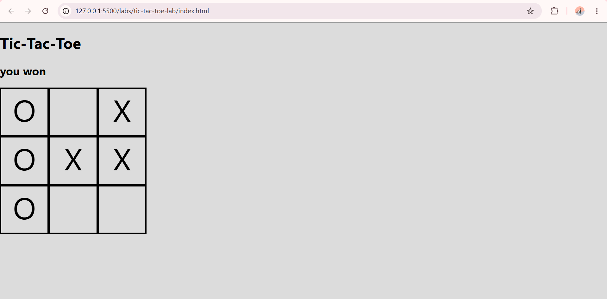

# Tic Tac Toe

## Technologies Used
- JavaScript
- HTML
- CSS

## Description
so basically its a fun basic game that required 2 players one of them will present as (x) and the other will present as(O)

## User Stories
1- i want a tilte appers on the page so i clearly know iam in the right page
2- i want to know that if its my turn or not 
3-i want to know the status of the game 
## Screenshots

## Future Enhancements
-  limit the time for the game so it become harder
-  playing online w my friends & family
- customize my x or o change the color or even replace it with  another character
- dark mode 
- run it as application 
- add more players to the game & levels 

## Credits
- my fav teacher:MR.Ommar 
- my lovely best friend:Raghad :3
